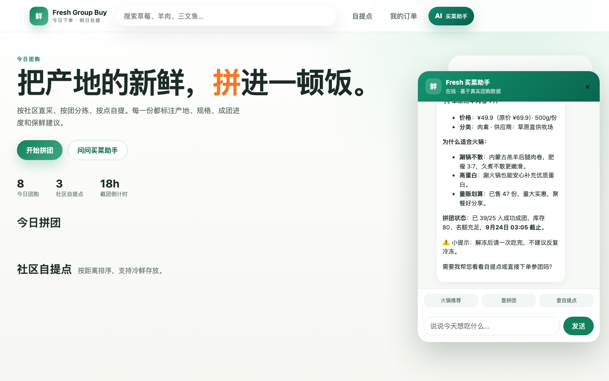
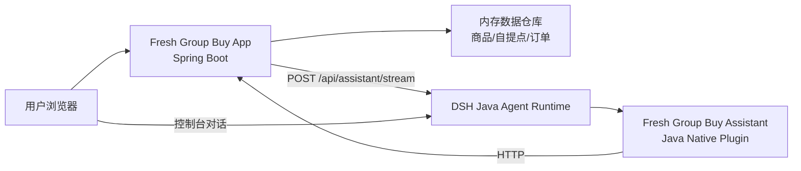

# Fresh Group Buy · P2 生鲜社区团购

基于 [DSH Java](https://dsh-java.xiaofuge.cn/) 的生鲜社区团购示例：一个 PC 端团购应用 + Java Native 插件。业务应用提供今日团购、拼团进度、社区自提点、下单与订单管理；插件把这些能力注册成 Agent 工具，让 AI 基于真实接口推荐商品、查询拼团和自提点。

## 使用说明

- **这是什么**：一个 PC 端生鲜社区团购应用，配套 DSH Java 插件，把商品、拼团、自提点、订单暴露给 Agent。
- **你能做什么**：浏览今日团购、查看拼团进度、选择自提点、下单参团；AI 助手能按口味推荐食材、查拼团和找取货点。
- **怎么用**：启动应用和 DSH 后，右下角打开 AI 助手提问，或在 DSH 控制台用同一插件对话。
- **适合谁**：想快速体验社区团购闭环、学习 Java Native Plugin、或沉淀项目材料的人。

## 快捷体验流程

1. 打开应用：<http://127.0.0.1:18082>
2. 右下角点击 **AI 买菜助手**，问：`推荐一款适合火锅的食材，并说明原因。`
3. 继续问：`查一下 g003 的拼团进度。`
4. 继续问：`最近的取货点在哪？`
5. 在页面上选商品、数量和自提点，点击 **立即参团**。
6. 打开 DSH 控制台：<http://127.0.0.1:8090>，使用同一插件工具集验证 Agent 对话。

当前服务在本机验证通过，插件 `fresh-group-buy-assistant` 已安装激活。长驻服务可能被回收；重启应用可执行：

```bash
java -jar fresh-group-buy-app/target/fresh-group-buy-app-1.0.0-SNAPSHOT.jar --server.port=18082
```

## 项目介绍




### 核心能力

1. 今日团购商品：8 个生鲜 SKU，含价格、原价、规格、库存、成团人数、截止时间和供应商。
2. 拼团进度：每个商品都有 `minGroupSize`、`currentParticipants` 和 `progressPercent`。
3. 社区自提点：3 个自提点，含地址、营业时间、距离、容量和特色服务。
4. 下单参团：选择商品、数量和自提点，生成订单号、取货码和计划取货时间。
5. AI 助手：SSE 流式对话，底层调用 DSH Agent 和插件工具。

## 插件工具

| Agent 工具 | 能力 | 已验证 |
|---|---|---|
| `plugin__fresh-group-buy-assistant__search_products` | 搜索今日团购商品 | ✅ 火锅推荐实测 |
| `plugin__fresh-group-buy-assistant__product_detail` | 查商品完整详情 | ✅ `g003` 实测 |
| `plugin__fresh-group-buy-assistant__group_status` | 查拼团进度 | ✅ `g003` 实测 |
| `plugin__fresh-group-buy-assistant__pickup_points` | 查社区自提点 | ✅ 最近取货点实测 |
| `plugin__fresh-group-buy-assistant__order_query` | 查用户团购订单 | ✅ `customer-1` 实测 |

插件配置：

```json
{
  "groupbuy.base-url": "http://127.0.0.1:18082"
}
```

修改配置后需停用再启用插件，让 `configure(PluginContext)` 重新执行。

## 本地运行

### 环境要求

- JDK 17+
- Maven 3.9+
- 本机 18082、8090 端口空闲

### 构建

```bash
mvn clean package -DskipTests
```

### 启动应用

```bash
java -jar fresh-group-buy-app/target/fresh-group-buy-app-1.0.0-SNAPSHOT.jar --server.port=18082
```

### 启动 DSH

```bash
bash /Users/fuzhengwei/.codex/skills/dsh-java-plugin-skills/scripts/start_harness.sh
```

### 安装插件

```bash
bash /Users/fuzhengwei/.codex/skills/dsh-java-plugin-skills/scripts/install_plugin.sh \
  "$PWD/fresh-group-buy-plugin/target/fresh-group-buy-plugin-1.0.0-SNAPSHOT.jar" \
  fresh-group-buy-assistant \
  1.0.0-SNAPSHOT \
  fresh-group-buy-plugin-1.0.0-SNAPSHOT.jar \
  "Fresh Group Buy Assistant"
```

## 架构



- `fresh-group-buy-app`：Spring Boot 3.3.2 业务应用，提供 REST API 和原生 HTML/CSS/JS 前端。
- `fresh-group-buy-plugin`：DSH Java Native 插件，通过 SPI 加载，注册 5 个工具。
- 插件不直连数据存储，只通过 HTTP 调用业务应用 API，保持业务校验边界。

## 验证记录

- `mvn clean package -DskipTests`：通过。
- 应用探活：`http://127.0.0.1:18082`，HTTP 200。
- DSH 探活：`http://127.0.0.1:8090`，HTTP 200。
- 插件状态：`fresh-group-buy-assistant ACTIVE`。
- 工具链路：商品搜索、商品详情、拼团进度、自提点、订单查询均通过 Agent 实测。
- 写链路：`POST /api/groupbuy/orders` 成功生成订单号 `GB202609231001` 和取货码。

## 预置数据

- 商品：丹东草莓、山东大葱、草原羔羊肉卷、有机菠菜、挪威三文鱼、现磨豆浆原料包、台州小黄鱼、烟台苹果。
- 自提点：梧桐里社区服务站、滨江生活广场团点、科技园区前沿驿站。
- 用户：`customer-1`。

## 简历项目描述

**Fresh Group Buy · DSH Java 场景案例（P2 生鲜社区团购）**

- 基于 Java 17 + Spring Boot 3 构建生鲜社区团购应用，完成商品、拼团进度、自提点和订单管理闭环。
- 使用 DSH Java Native Plugin 开发智能买菜助手，注册 5 个 Agent 工具，让模型基于业务 API 推荐食材、查询拼团和定位自提点。
- 设计插件-应用 HTTP 边界，插件只做能力适配，不直连数据资源，保留业务校验和数据所有权。
- 实现 SSE 流式 AI 助手和真实浏览器 UI，商品推荐、拼团进度、自提点和订单查询全链路实测通过。

## 面试要点

1. **为什么要用插件而不直接让模型查库？**  
   插件作为 Agent 与业务系统之间的适配层；业务应用保留鉴权、校验和数据所有权，模型只能调用受控工具。
2. **如何避免 AI 编造价格和库存？**  
   插件系统提示词强制商品类问题必须调用 `search_products` / `product_detail`，价格、库存、拼团和订单只能来自工具结果。
3. **Java Native Plugin 的加载流程是什么？**  
   `plugin.yaml` 描述插件，SPI 声明实现类，DSH 加载 JAR 后调用 `tools()` 注册工具，`configure()` 读取配置并注册系统提示词和 Hook。
4. **前端 AI 面板怎么处理流式输出？**  
   应用后端代理 DSH SSE，前端读取 `chunk` 事件，逐块更新气泡并用轻量 Markdown 渲染器输出标题、列表和加粗。
5. **为什么用内存数据？**  
   演示场景要保证零数据库依赖、快速启动和可重复验收；重启即还原种子数据，便于反复验证写操作。
