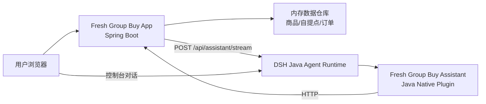

# Fresh Group Buy 设计说明

## 产品定位

Fresh Group Buy 是一个 PC 端生鲜社区团购示例，围绕“看得清产地、拼得出人数、找得到取货点”的体验展开。项目不是把 AI 挂在页面角落，而是让商品、拼团、自提点和订单全部进入 Agent 工具体系。

## 业务闭环

1. 今日团购：展示商品、价格、规格、库存、成团人数和截止时间。
2. 拼团进度：按商品维度展示当前人数、剩余名额、进度百分比。
3. 社区自提点：按距离排序，提供地址、营业时间、容量和特色服务。
4. 下单参团：选择商品、数量、自提点，生成订单号和取货码。
5. 订单管理：按用户查询订单列表和订单详情。

## 架构

业务应用保留商品、库存、订单校验和数据所有权；插件只做能力适配，不复制业务规则，也不直接持有数据。AI 的推荐必须回到业务接口查证。

## 插件边界

插件 ID：`fresh-group-buy-assistant`。注册工具：

| 工具 | 何时调用 | 返回 |
|---|---|---|
| `search_products` | 推荐、对比、分类、库存、价格问题 | 商品摘要列表 |
| `product_detail` | 已知商品 ID 或需要完整参数 | 商品详情 |
| `group_status` | 已知商品 ID，查拼团进度 | 拼团进度 |
| `pickup_points` | 自提点、取货点、距离、营业时间问题 | 自提点列表 |
| `order_query` | 查询用户订单 | 订单列表 |

插件通过 `registerSystemPrompt` 限制：只使用工具返回的数据、不虚构商家和价格、不承诺真实配送时效或食品安全。`POST_TOOL_USE` 会发布 `fresh-group-buy-assistant.tool.used` 审计事件。

## 界面设计语言

- 主色：生鲜绿 `#13805C`，用于品牌、导航和主操作。
- 强调色：活力橙 `#F2792A`，突出价格与今日推荐。
- 背景材质：浅绿底上的柔和光斑，呼应产地和新鲜感。
- 标志性元素：圆形商品 emoji + 进度条 + 成团人数。
- AI 面板：右下角浮动按钮，侧滑流式输出，Markdown 渲染。

## 数据策略

演示环境使用内存数据，重启即还原种子状态，适合快速体验和自动化测试。种子数据包含 8 个生鲜 SKU、3 个社区自提点、1 个演示用户，避免“商品 A/自提点 A”这类占位内容。
